# FileHatch DB 스키마 레퍼런스

> **현재 버전:** 0.10.1
> **DBMS:** PostgreSQL 17 (Alpine)
> **마이그레이션 시스템:** `api/database/migrations/` (순차 SQL 파일)
> **초기화 파일:** `db/init.sql` (Docker 첫 실행 시 자동 적용)

---

## 목차

1. [테이블 개요](#테이블-개요)
2. [테이블 상세](#테이블-상세)
3. [ER 다이어그램](#er-다이어그램)
4. [인덱스 전체 목록](#인덱스-전체-목록)
5. [마이그레이션 파일 목록](#마이그레이션-파일-목록)
6. [기본 데이터](#기본-데이터)

---

## 테이블 개요

| # | 테이블명 | PK 타입 | 설명 | FK 관계 |
|---|---------|---------|------|---------|
| 1 | `users` | UUID | 사용자 계정 (웹 + SMB 인증) | - |
| 2 | `acl` | BIGSERIAL | 접근 제어 목록 (파일/폴더 권한) | entity_id (논리적) |
| 3 | `audit_logs` | BIGSERIAL | 불변 감사 로그 | actor_id -> users (nullable) |
| 4 | `shares` | UUID | 공개 링크 공유 (다운로드/업로드/편집) | created_by -> users |
| 5 | `shared_folders` | UUID | 팀 공유 드라이브 | created_by -> users |
| 6 | `shared_folder_members` | BIGSERIAL | 공유 폴더 멤버 권한 | shared_folder_id, user_id, added_by -> users |
| 7 | `file_shares` | BIGSERIAL | 사용자 간 파일 공유 | owner_id, shared_with_id -> users |
| 8 | `system_settings` | VARCHAR(100) | 시스템 설정 (KV 저장소) | updated_by -> users (nullable) |
| 9 | `file_metadata` | BIGSERIAL | 파일 설명 및 태그 | user_id -> users |
| 10 | `notifications` | BIGSERIAL | 인앱 알림 | user_id, actor_id -> users |
| 11 | `sso_providers` | UUID | OAuth2/OIDC SSO 프로바이더 설정 | - |
| 12 | `starred_files` | UUID | 즐겨찾기 | user_id -> users |
| 13 | `file_locks` | UUID | 파일 잠금 (동시 편집 방지) | locked_by -> users |
| 14 | `external_storages` | UUID | 외부 스토리지 (S3/로컬 마운트) | created_by -> users |
| 15 | `external_storage_access` | BIGSERIAL | 외부 스토리지 사용자 접근 권한 | external_storage_id, user_id, granted_by -> users |
| 16 | `transfer_jobs` | UUID | 서버 사이드 전송 작업 (복사/이동/압축/삭제) | user_id -> users |
| 17 | `user_preferences` | - | 사용자 환경설정 (users.preferences JSONB 컬럼) | users 테이블에 직접 포함 |
| 18 | `hidden_recent_items` | UUID | 최근 항목 숨기기 | user_id -> users |
| 19 | `schema_migrations` | VARCHAR(14) | 마이그레이션 버전 트래킹 | - |

---

## 테이블 상세

### 1. users

> 사용자 계정 (웹 인증 + SMB 인증). 시스템의 핵심 엔티티.

| 컬럼 | 타입 | 기본값 | NULL | 설명 |
|------|------|--------|------|------|
| `id` | UUID | `gen_random_uuid()` | NOT NULL | **PK** |
| `username` | VARCHAR(50) | - | NOT NULL | **UNIQUE**. 사용자명 |
| `email` | VARCHAR(255) | - | NULL | 이메일 주소 |
| `password_hash` | VARCHAR(255) | - | NULL | bcrypt 해시 (SSO 사용자는 NULL) |
| `smb_hash` | VARCHAR(255) | - | NULL | SMB 인증용 해시 |
| `provider` | VARCHAR(20) | `'local'` | - | 인증 프로바이더 (local/oidc 등) |
| `provider_id` | VARCHAR(255) | - | NULL | 외부 프로바이더 사용자 ID |
| `is_admin` | BOOLEAN | `FALSE` | - | 관리자 여부 |
| `is_active` | BOOLEAN | `TRUE` | - | 계정 활성 상태 |
| `storage_quota` | BIGINT | `0` | - | 저장 공간 할당량 (바이트, 0=무제한) |
| `storage_used` | BIGINT | `0` | - | 사용 중인 저장 공간 (바이트) |
| `trash_used` | BIGINT | `0` | - | 휴지통 사용량 (바이트) |
| `totp_secret` | VARCHAR(255) | - | NULL | TOTP 2FA 시크릿 |
| `totp_enabled` | BOOLEAN | `FALSE` | - | 2FA 활성화 여부 |
| `totp_backup_codes` | TEXT | - | NULL | 2FA 백업 코드 |
| `locked_until` | TIMESTAMPTZ | `NULL` | NULL | 계정 잠금 만료 시각 |
| `failed_login_count` | INT | `0` | - | 연속 로그인 실패 횟수 |
| `last_failed_login` | TIMESTAMPTZ | `NULL` | NULL | 마지막 실패 시각 |
| `setup_completed` | BOOLEAN | `TRUE` | - | 초기 설정 완료 여부 (FALSE면 첫 로그인 시 설정 강제) |
| `preferences` | JSONB | `'{}'` | NULL | 사용자 환경설정 (마이그레이션 005에서 추가) |
| `created_at` | TIMESTAMPTZ | `NOW()` | - | 생성 시각 |
| `updated_at` | TIMESTAMPTZ | `NOW()` | - | 수정 시각 |

**인덱스:**
| 인덱스명 | 컬럼 | 조건 |
|---------|------|------|
| `idx_users_username` | `username` | - |
| `idx_users_email` | `email` | - |
| `idx_users_storage` | `storage_used` | - |
| `idx_users_locked_until` | `locked_until` | `WHERE locked_until IS NOT NULL` |
| `idx_users_active` | `username, is_active` | `WHERE is_active = TRUE` |

---

### 2. acl

> 접근 제어 목록. 파일/폴더 경로에 대한 엔티티(사용자/그룹)별 권한.

| 컬럼 | 타입 | 기본값 | NULL | 설명 |
|------|------|--------|------|------|
| `id` | BIGSERIAL | auto | NOT NULL | **PK** |
| `path` | VARCHAR(1000) | - | NOT NULL | 파일/폴더 경로 |
| `entity_type` | VARCHAR(10) | - | NOT NULL | 엔티티 타입 (user/group) |
| `entity_id` | UUID | - | NOT NULL | 엔티티 ID |
| `permission_level` | INT | - | NOT NULL | 권한 레벨 |
| `created_at` | TIMESTAMPTZ | `NOW()` | - | 생성 시각 |

**제약조건:** `UNIQUE(path, entity_type, entity_id)`

**인덱스:**
| 인덱스명 | 컬럼 |
|---------|------|
| `idx_acl_path` | `path` |

---

### 3. audit_logs

> 불변 감사 로그. 모든 중요 작업을 기록. 삭제/수정 불가 원칙.

| 컬럼 | 타입 | 기본값 | NULL | 설명 |
|------|------|--------|------|------|
| `id` | BIGSERIAL | auto | NOT NULL | **PK** |
| `ts` | TIMESTAMPTZ | `NOW()` | - | 이벤트 발생 시각 |
| `actor_id` | UUID | - | NULL | 수행 사용자 (비로그인 시 NULL) |
| `ip_addr` | INET | - | NULL | 클라이언트 IP 주소 |
| `event_type` | VARCHAR(50) | - | NOT NULL | 이벤트 유형 (예: `file.upload`, `security.login`) |
| `target_resource` | VARCHAR(1000) | - | NULL | 대상 리소스 경로 |
| `details` | JSONB | - | NULL | 추가 상세 정보 |

**인덱스:**
| 인덱스명 | 컬럼 | 조건 |
|---------|------|------|
| `idx_audit_ts` | `ts` | - |
| `idx_audit_target` | `target_resource` | - |
| `idx_audit_actor` | `actor_id` | - |
| `idx_audit_type_ts` | `event_type, ts DESC` | - |
| `idx_audit_security_events` | `event_type, ts DESC` | `WHERE event_type LIKE 'security.%'` |

---

### 4. shares

> 공개 링크 공유. 다운로드/업로드/편집 세 가지 타입 지원.

| 컬럼 | 타입 | 기본값 | NULL | 설명 |
|------|------|--------|------|------|
| `id` | UUID | `gen_random_uuid()` | NOT NULL | **PK** |
| `token` | VARCHAR(64) | - | NOT NULL | **UNIQUE**. 공유 URL 토큰 |
| `path` | VARCHAR(1000) | - | NOT NULL | 공유 대상 파일/폴더 경로 |
| `created_by` | UUID | - | NULL | **FK -> users(id)**. 생성자 |
| `created_at` | TIMESTAMPTZ | `NOW()` | - | 생성 시각 |
| `expires_at` | TIMESTAMPTZ | - | NULL | 만료 시각 (NULL=무기한) |
| `password_hash` | VARCHAR(255) | - | NULL | 비밀번호 보호 (bcrypt) |
| `access_count` | INT | `0` | - | 접근 횟수 |
| `max_access` | INT | - | NULL | 최대 접근 횟수 (NULL=무제한) |
| `is_active` | BOOLEAN | `TRUE` | - | 활성 상태 |
| `require_login` | BOOLEAN | `FALSE` | - | 로그인 필수 여부 |
| `share_type` | VARCHAR(20) | `'download'` | NOT NULL | 공유 타입: `download`/`upload`/`edit` |
| `editable` | BOOLEAN | `FALSE` | - | 편집 가능 여부 |
| `max_file_size` | BIGINT | `0` | - | 업로드 최대 파일 크기 (0=제한 없음) |
| `allowed_extensions` | TEXT | - | NULL | 허용 확장자 (쉼표 구분) |
| `upload_count` | INT | `0` | - | 업로드된 파일 수 |
| `max_total_size` | BIGINT | `0` | - | 업로드 총 용량 제한 (0=제한 없음) |
| `total_uploaded_size` | BIGINT | `0` | - | 현재까지 업로드된 총 크기 |
| `expiration_notified` | BOOLEAN | `FALSE` | - | 만료 알림 전송 여부 |
| `expiration_notified_at` | TIMESTAMPTZ | - | NULL | 만료 알림 전송 시각 |

**인덱스:**
| 인덱스명 | 컬럼 |
|---------|------|
| `idx_shares_token` | `token` |
| `idx_shares_created_by` | `created_by` |
| `idx_shares_type` | `share_type` |

---

### 5. shared_folders

> 팀 공유 드라이브. 여러 사용자가 접근 가능한 공유 폴더.

| 컬럼 | 타입 | 기본값 | NULL | 설명 |
|------|------|--------|------|------|
| `id` | UUID | `gen_random_uuid()` | NOT NULL | **PK** |
| `name` | VARCHAR(255) | - | NOT NULL | 공유 폴더 이름 |
| `description` | TEXT | - | NULL | 설명 |
| `storage_quota` | BIGINT | `0` | - | 스토리지 쿼터 (바이트, 0=무제한) |
| `storage_used` | BIGINT | `0` | - | 사용 중인 스토리지 (바이트) |
| `created_by` | UUID | - | NULL | **FK -> users(id)**. 생성자 |
| `created_at` | TIMESTAMPTZ | `NOW()` | - | 생성 시각 |
| `updated_at` | TIMESTAMPTZ | `NOW()` | - | 수정 시각 |
| `is_active` | BOOLEAN | `TRUE` | - | 활성 상태 |

**인덱스:**
| 인덱스명 | 컬럼 | 조건 |
|---------|------|------|
| `idx_shared_folders_name` | `name` | - |
| `idx_shared_folders_active` | `is_active` | - |
| `idx_shared_folders_name_active` | `name, is_active` | `WHERE is_active = TRUE` |
| `idx_shared_folders_quota` | `storage_quota, storage_used` | `WHERE is_active = TRUE AND storage_quota > 0` |

---

### 6. shared_folder_members

> 공유 폴더 멤버십. 사용자별 접근 권한 관리.

| 컬럼 | 타입 | 기본값 | NULL | 설명 |
|------|------|--------|------|------|
| `id` | BIGSERIAL | auto | NOT NULL | **PK** |
| `shared_folder_id` | UUID | - | NOT NULL | **FK -> shared_folders(id) ON DELETE CASCADE** |
| `user_id` | UUID | - | NOT NULL | **FK -> users(id) ON DELETE CASCADE** |
| `permission_level` | INT | `1` | NOT NULL | 권한 (1=읽기, 2=읽기/쓰기) |
| `added_by` | UUID | - | NULL | **FK -> users(id)**. 추가한 사용자 |
| `created_at` | TIMESTAMPTZ | `NOW()` | - | 추가 시각 |

**제약조건:** `UNIQUE(shared_folder_id, user_id)`

**인덱스:**
| 인덱스명 | 컬럼 |
|---------|------|
| `idx_shared_folder_members_folder` | `shared_folder_id` |
| `idx_shared_folder_members_user` | `user_id` |
| `idx_sfm_user_folder` | `user_id, shared_folder_id` |

---

### 7. file_shares

> 사용자 간 직접 파일/폴더 공유. 특정 사용자에게 읽기 또는 읽기/쓰기 권한 부여.

| 컬럼 | 타입 | 기본값 | NULL | 설명 |
|------|------|--------|------|------|
| `id` | BIGSERIAL | auto | NOT NULL | **PK** |
| `item_path` | VARCHAR(1024) | - | NOT NULL | 공유 항목 경로 |
| `item_name` | VARCHAR(255) | - | NOT NULL | 공유 항목 이름 |
| `is_folder` | BOOLEAN | `FALSE` | NOT NULL | 폴더 여부 |
| `owner_id` | UUID | - | NOT NULL | **FK -> users(id) ON DELETE CASCADE**. 소유자 |
| `shared_with_id` | UUID | - | NOT NULL | **FK -> users(id) ON DELETE CASCADE**. 공유 대상 |
| `permission_level` | INT | `1` | NOT NULL | 권한 (1=읽기, 2=읽기/쓰기) |
| `message` | TEXT | - | NULL | 공유 메시지 |
| `created_at` | TIMESTAMPTZ | `NOW()` | - | 생성 시각 |
| `updated_at` | TIMESTAMPTZ | `NOW()` | - | 수정 시각 |

**제약조건:** `UNIQUE(item_path, owner_id, shared_with_id)`

**인덱스:**
| 인덱스명 | 컬럼 |
|---------|------|
| `idx_file_shares_owner` | `owner_id` |
| `idx_file_shares_shared_with` | `shared_with_id` |
| `idx_file_shares_path` | `item_path` |
| `idx_file_shares_recipient_path` | `shared_with_id, item_path` |
| `idx_file_shares_owner_path` | `owner_id, item_path` |
| `idx_file_shares_shared_with_folder` | `shared_with_id, is_folder, created_at DESC` |

---

### 8. system_settings

> 시스템 전역 설정. Key-Value 저장소. 관리자 패널에서 관리.

| 컬럼 | 타입 | 기본값 | NULL | 설명 |
|------|------|--------|------|------|
| `key` | VARCHAR(100) | - | NOT NULL | **PK**. 설정 키 |
| `value` | TEXT | - | NOT NULL | 설정 값 |
| `description` | TEXT | - | NULL | 설명 |
| `updated_by` | UUID | - | NULL | **FK -> users(id)**. 마지막 수정자 |
| `updated_at` | TIMESTAMPTZ | `NOW()` | - | 수정 시각 |

**인덱스:**
| 인덱스명 | 컬럼 |
|---------|------|
| `idx_system_settings_key` | `key` |

---

### 9. file_metadata

> 파일 메타데이터. 설명과 태그를 JSONB로 관리. GIN 인덱스로 태그 검색 지원.

| 컬럼 | 타입 | 기본값 | NULL | 설명 |
|------|------|--------|------|------|
| `id` | BIGSERIAL | auto | NOT NULL | **PK** |
| `user_id` | UUID | - | NOT NULL | **FK -> users(id) ON DELETE CASCADE** |
| `file_path` | VARCHAR(1024) | - | NOT NULL | 파일 경로 |
| `description` | TEXT | - | NULL | 파일 설명 |
| `tags` | JSONB | `'[]'` | - | 태그 배열 (예: `["important", "work"]`) |
| `created_at` | TIMESTAMPTZ | `NOW()` | - | 생성 시각 |
| `updated_at` | TIMESTAMPTZ | `NOW()` | - | 수정 시각 |

**제약조건:** `UNIQUE(user_id, file_path)`

**인덱스:**
| 인덱스명 | 컬럼 | 타입 |
|---------|------|------|
| `idx_file_metadata_user` | `user_id` | B-tree |
| `idx_file_metadata_path` | `file_path` | B-tree |
| `idx_file_metadata_tags` | `tags` | **GIN** |

---

### 10. notifications

> 인앱 알림. 공유 수신, 파일 변경 등 사용자별 알림.

| 컬럼 | 타입 | 기본값 | NULL | 설명 |
|------|------|--------|------|------|
| `id` | BIGSERIAL | auto | NOT NULL | **PK** |
| `user_id` | UUID | - | NOT NULL | **FK -> users(id) ON DELETE CASCADE**. 수신자 |
| `type` | VARCHAR(50) | - | NOT NULL | 알림 타입 |
| `title` | VARCHAR(255) | - | NOT NULL | 제목 |
| `message` | TEXT | - | NULL | 메시지 본문 |
| `link` | VARCHAR(500) | - | NULL | 관련 링크 |
| `actor_id` | UUID | - | NULL | **FK -> users(id) ON DELETE SET NULL**. 발생자 |
| `is_read` | BOOLEAN | `FALSE` | - | 읽음 상태 |
| `created_at` | TIMESTAMPTZ | `NOW()` | - | 생성 시각 |
| `metadata` | JSONB | - | NULL | 추가 메타데이터 |

**인덱스:**
| 인덱스명 | 컬럼 | 조건 |
|---------|------|------|
| `idx_notifications_user` | `user_id, is_read, created_at DESC` | - |
| `idx_notifications_created` | `created_at` | - |
| `idx_notifications_unread` | `user_id, created_at DESC` | `WHERE is_read = FALSE` |

---

### 11. sso_providers

> OAuth2/OIDC SSO 프로바이더 설정. 관리자 패널에서 설정. `client_secret`은 AES-256-GCM 암호화.

| 컬럼 | 타입 | 기본값 | NULL | 설명 |
|------|------|--------|------|------|
| `id` | UUID | `gen_random_uuid()` | NOT NULL | **PK** |
| `name` | VARCHAR(100) | - | NOT NULL | 프로바이더 이름 |
| `provider_type` | VARCHAR(50) | - | NOT NULL | 타입 (oidc/oauth2 등) |
| `client_id` | VARCHAR(255) | - | NOT NULL | OAuth Client ID |
| `client_secret` | VARCHAR(500) | - | NOT NULL | OAuth Client Secret (암호화) |
| `issuer_url` | VARCHAR(500) | - | NULL | OIDC Issuer URL |
| `authorization_url` | VARCHAR(500) | - | NULL | Authorization Endpoint |
| `token_url` | VARCHAR(500) | - | NULL | Token Endpoint |
| `userinfo_url` | VARCHAR(500) | - | NULL | UserInfo Endpoint |
| `scopes` | VARCHAR(500) | `'openid email profile'` | - | 요청 스코프 |
| `allowed_domains` | TEXT | - | NULL | 허용 이메일 도메인 (쉼표 구분) |
| `auto_create_user` | BOOLEAN | `TRUE` | - | 첫 로그인 시 자동 사용자 생성 |
| `default_admin` | BOOLEAN | `FALSE` | - | 생성 사용자 기본 관리자 여부 |
| `is_enabled` | BOOLEAN | `TRUE` | - | 활성화 상태 |
| `display_order` | INT | `0` | - | 표시 순서 |
| `icon_url` | VARCHAR(500) | - | NULL | 버튼 아이콘 URL |
| `button_color` | VARCHAR(20) | - | NULL | 버튼 색상 |
| `created_at` | TIMESTAMPTZ | `NOW()` | - | 생성 시각 |
| `updated_at` | TIMESTAMPTZ | `NOW()` | - | 수정 시각 |

**인덱스:**
| 인덱스명 | 컬럼 |
|---------|------|
| `idx_sso_providers_enabled` | `is_enabled` |
| `idx_sso_providers_type` | `provider_type` |

---

### 12. starred_files

> 사용자 즐겨찾기 파일/폴더.

| 컬럼 | 타입 | 기본값 | NULL | 설명 |
|------|------|--------|------|------|
| `id` | UUID | `gen_random_uuid()` | NOT NULL | **PK** |
| `user_id` | UUID | - | NOT NULL | **FK -> users(id) ON DELETE CASCADE** |
| `file_path` | VARCHAR(1024) | - | NOT NULL | 파일 경로 |
| `starred_at` | TIMESTAMPTZ | `NOW()` | - | 즐겨찾기 시각 |

**제약조건:** `UNIQUE(user_id, file_path)`

**인덱스:**
| 인덱스명 | 컬럼 |
|---------|------|
| `idx_starred_files_user` | `user_id` |
| `idx_starred_files_path` | `file_path` |

---

### 13. file_locks

> 파일 잠금. 동시 편집 방지. 파일 경로는 UNIQUE (한 파일에 하나의 잠금만 가능).

| 컬럼 | 타입 | 기본값 | NULL | 설명 |
|------|------|--------|------|------|
| `id` | UUID | `gen_random_uuid()` | NOT NULL | **PK** |
| `file_path` | VARCHAR(1024) | - | NOT NULL | **UNIQUE**. 잠긴 파일 경로 |
| `locked_by` | UUID | - | NOT NULL | **FK -> users(id) ON DELETE CASCADE**. 잠금 소유자 |
| `locked_at` | TIMESTAMPTZ | `NOW()` | - | 잠금 시각 |
| `expires_at` | TIMESTAMPTZ | - | NULL | 만료 시각 (NULL=수동 해제만 가능) |
| `lock_type` | VARCHAR(20) | `'exclusive'` | - | 잠금 유형 |
| `reason` | VARCHAR(255) | - | NULL | 잠금 사유 |

**인덱스:**
| 인덱스명 | 컬럼 | 조건 |
|---------|------|------|
| `idx_file_locks_path` | `file_path` | - |
| `idx_file_locks_user` | `locked_by` | - |
| `idx_file_locks_expires` | `expires_at` | `WHERE expires_at IS NOT NULL` |

---

### 14. external_storages

> 외부 스토리지 연결. S3 호환 오브젝트 스토리지 또는 로컬 마운트 포인트.

| 컬럼 | 타입 | 기본값 | NULL | 설명 |
|------|------|--------|------|------|
| `id` | UUID | `gen_random_uuid()` | NOT NULL | **PK** |
| `name` | VARCHAR(255) | - | NOT NULL | 스토리지 이름 |
| `mount_path` | VARCHAR(255) | - | NOT NULL | **UNIQUE**. 마운트 경로 (예: `company-s3`) |
| `backend_type` | VARCHAR(50) | - | NOT NULL | 백엔드 타입: `s3`, `local-mount` |
| `config_encrypted` | TEXT | - | NOT NULL | AES-256-GCM 암호화된 JSON 설정 |
| `status` | VARCHAR(20) | `'active'` | - | 상태: `active`, `disabled`, `error` |
| `status_message` | TEXT | - | NULL | 상태 메시지 |
| `last_checked_at` | TIMESTAMPTZ | - | NULL | 마지막 상태 확인 시각 |
| `storage_used` | BIGINT | `0` | - | 사용 중인 용량 (바이트) |
| `storage_quota` | BIGINT | `0` | - | 쿼터 (0=무제한) |
| `created_by` | UUID | - | NULL | **FK -> users(id) ON DELETE SET NULL** |
| `created_at` | TIMESTAMPTZ | `NOW()` | - | 생성 시각 |
| `updated_at` | TIMESTAMPTZ | `NOW()` | - | 수정 시각 |
| `is_readonly` | BOOLEAN | `FALSE` | - | 읽기 전용 여부 |

**인덱스:**
| 인덱스명 | 컬럼 |
|---------|------|
| `idx_external_storages_mount_path` | `mount_path` |
| `idx_external_storages_status` | `status` |

---

### 15. external_storage_access

> 외부 스토리지 사용자별 접근 권한.

| 컬럼 | 타입 | 기본값 | NULL | 설명 |
|------|------|--------|------|------|
| `id` | BIGSERIAL | auto | NOT NULL | **PK** |
| `external_storage_id` | UUID | - | NOT NULL | **FK -> external_storages(id) ON DELETE CASCADE** |
| `user_id` | UUID | - | NOT NULL | **FK -> users(id) ON DELETE CASCADE** |
| `permission_level` | INT | `1` | NOT NULL | 권한 (1=읽기, 2=읽기/쓰기) |
| `granted_by` | UUID | - | NULL | **FK -> users(id) ON DELETE SET NULL**. 권한 부여자 |
| `created_at` | TIMESTAMPTZ | `NOW()` | - | 생성 시각 |

**제약조건:** `UNIQUE(external_storage_id, user_id)`

**인덱스:**
| 인덱스명 | 컬럼 |
|---------|------|
| `idx_external_storage_access_user` | `user_id` |
| `idx_external_storage_access_storage` | `external_storage_id` |

---

### 16. transfer_jobs

> 서버 사이드 전송 작업 큐. 복사/이동/압축/삭제 작업을 서버에서 비동기 처리.

| 컬럼 | 타입 | 기본값 | NULL | 설명 |
|------|------|--------|------|------|
| `id` | UUID | `gen_random_uuid()` | NOT NULL | **PK** |
| `user_id` | UUID | - | NOT NULL | **FK -> users(id) ON DELETE CASCADE** |
| `type` | VARCHAR(20) | - | NOT NULL | 작업 타입: `copy`, `move`, `compress`, `delete` |
| `status` | VARCHAR(20) | `'pending'` | NOT NULL | 상태: `pending`, `running`, `completed`, `error`, `cancelled` |
| `source_path` | TEXT | - | NOT NULL | 원본 경로 |
| `destination_path` | TEXT | - | NULL | 목적 경로 |
| `total_bytes` | BIGINT | `0` | - | 전체 크기 (바이트) |
| `copied_bytes` | BIGINT | `0` | - | 처리된 크기 (바이트) |
| `total_files` | INT | `0` | - | 전체 파일 수 |
| `copied_files` | INT | `0` | - | 처리된 파일 수 |
| `current_file` | TEXT | - | NULL | 현재 처리 중인 파일 |
| `bytes_per_sec` | BIGINT | `0` | - | 전송 속도 (바이트/초) |
| `error_message` | TEXT | - | NULL | 에러 메시지 |
| `mode` | VARCHAR(20) | - | NULL | 모드: `merge`, `overwrite`, `rename` 등 |
| `file_conflict` | VARCHAR(20) | - | NULL | 충돌 처리: `overwrite`, `skip`, `rename` |
| `delete_paths` | JSONB | - | NULL | 삭제 대상 경로 목록 (마이그레이션 008에서 추가) |
| `created_at` | TIMESTAMPTZ | `NOW()` | - | 생성 시각 |
| `updated_at` | TIMESTAMPTZ | `NOW()` | - | 수정 시각 |
| `completed_at` | TIMESTAMPTZ | - | NULL | 완료 시각 |

**인덱스:**
| 인덱스명 | 컬럼 |
|---------|------|
| `idx_transfer_jobs_user` | `user_id, status` |

---

### 17. users.preferences (JSONB 컬럼)

> 사용자 환경설정. `users` 테이블의 `preferences` JSONB 컬럼으로 관리 (마이그레이션 005에서 추가).

**JSONB 구조:**
```json
{
  "sidebarOrder": ["files", "recent", "shared-drives", "external-storages", "sharing", "trash"],
  "sidebarHidden": [],
  "defaultLanding": ""
}
```

| 필드 | 타입 | 기본값 | 설명 |
|------|------|--------|------|
| `sidebarOrder` | string[] | `["files","recent","shared-drives","external-storages","sharing","trash"]` | 사이드바 섹션 순서 |
| `sidebarHidden` | string[] | `[]` | 숨긴 사이드바 섹션 |
| `defaultLanding` | string | `""` | 기본 랜딩 페이지 경로 |

---

### 18. hidden_recent_items

> 최근 항목 숨기기. "내 작업" 페이지에서 특정 항목을 숨기는 기능.

| 컬럼 | 타입 | 기본값 | NULL | 설명 |
|------|------|--------|------|------|
| `id` | UUID | `gen_random_uuid()` | NOT NULL | **PK** |
| `user_id` | UUID | - | NOT NULL | **FK -> users(id) ON DELETE CASCADE** |
| `file_path` | VARCHAR(1024) | - | NOT NULL | 숨길 파일 경로 |
| `hidden_at` | TIMESTAMPTZ | `NOW()` | - | 숨긴 시각 |

**제약조건:** `UNIQUE(user_id, file_path)`

**인덱스:**
| 인덱스명 | 컬럼 |
|---------|------|
| `idx_hidden_recent_user` | `user_id` |

---

### 19. schema_migrations

> 마이그레이션 버전 트래킹. 적용된 마이그레이션 기록.

| 컬럼 | 타입 | 기본값 | NULL | 설명 |
|------|------|--------|------|------|
| `version` | VARCHAR(14) | - | NOT NULL | **PK**. 버전 (형식: `YYYYMMDDHHMMSS`) |
| `name` | VARCHAR(255) | - | NOT NULL | 마이그레이션 이름 |
| `applied_at` | TIMESTAMPTZ | `NOW()` | - | 적용 시각 |
| `checksum` | VARCHAR(64) | - | NULL | SHA256 해시 (무결성 검증) |

---

## ER 다이어그램

```mermaid
erDiagram
    users ||--o{ audit_logs : "actor_id"
    users ||--o{ shares : "created_by"
    users ||--o{ shared_folders : "created_by"
    users ||--o{ shared_folder_members : "user_id"
    users ||--o{ shared_folder_members : "added_by"
    users ||--o{ file_shares : "owner_id"
    users ||--o{ file_shares : "shared_with_id"
    users ||--o{ system_settings : "updated_by"
    users ||--o{ file_metadata : "user_id"
    users ||--o{ notifications : "user_id"
    users ||--o{ notifications : "actor_id"
    users ||--o{ starred_files : "user_id"
    users ||--o{ file_locks : "locked_by"
    users ||--o{ external_storages : "created_by"
    users ||--o{ external_storage_access : "user_id"
    users ||--o{ external_storage_access : "granted_by"
    users ||--o{ transfer_jobs : "user_id"
    users ||--o{ hidden_recent_items : "user_id"

    shared_folders ||--o{ shared_folder_members : "shared_folder_id"
    external_storages ||--o{ external_storage_access : "external_storage_id"

    users {
        UUID id PK
        VARCHAR username UK
        VARCHAR email
        VARCHAR password_hash
        VARCHAR smb_hash
        VARCHAR provider
        VARCHAR provider_id
        BOOLEAN is_admin
        BOOLEAN is_active
        BIGINT storage_quota
        BIGINT storage_used
        BIGINT trash_used
        VARCHAR totp_secret
        BOOLEAN totp_enabled
        TEXT totp_backup_codes
        TIMESTAMPTZ locked_until
        INT failed_login_count
        TIMESTAMPTZ last_failed_login
        BOOLEAN setup_completed
        JSONB preferences
        TIMESTAMPTZ created_at
        TIMESTAMPTZ updated_at
    }

    shares {
        UUID id PK
        VARCHAR token UK
        VARCHAR path
        UUID created_by FK
        VARCHAR share_type
        BOOLEAN editable
        VARCHAR password_hash
        TIMESTAMPTZ expires_at
        INT access_count
        INT max_access
        BOOLEAN is_active
    }

    shared_folders {
        UUID id PK
        VARCHAR name
        TEXT description
        BIGINT storage_quota
        BIGINT storage_used
        UUID created_by FK
        BOOLEAN is_active
    }

    shared_folder_members {
        BIGSERIAL id PK
        UUID shared_folder_id FK
        UUID user_id FK
        INT permission_level
        UUID added_by FK
    }

    file_shares {
        BIGSERIAL id PK
        VARCHAR item_path
        VARCHAR item_name
        BOOLEAN is_folder
        UUID owner_id FK
        UUID shared_with_id FK
        INT permission_level
        TEXT message
    }

    audit_logs {
        BIGSERIAL id PK
        TIMESTAMPTZ ts
        UUID actor_id FK
        INET ip_addr
        VARCHAR event_type
        VARCHAR target_resource
        JSONB details
    }

    system_settings {
        VARCHAR key PK
        TEXT value
        TEXT description
        UUID updated_by FK
    }

    file_metadata {
        BIGSERIAL id PK
        UUID user_id FK
        VARCHAR file_path
        TEXT description
        JSONB tags
    }

    notifications {
        BIGSERIAL id PK
        UUID user_id FK
        VARCHAR type
        VARCHAR title
        TEXT message
        UUID actor_id FK
        BOOLEAN is_read
        JSONB metadata
    }

    sso_providers {
        UUID id PK
        VARCHAR name
        VARCHAR provider_type
        VARCHAR client_id
        VARCHAR client_secret
        VARCHAR issuer_url
        BOOLEAN is_enabled
    }

    starred_files {
        UUID id PK
        UUID user_id FK
        VARCHAR file_path
        TIMESTAMPTZ starred_at
    }

    file_locks {
        UUID id PK
        VARCHAR file_path UK
        UUID locked_by FK
        TIMESTAMPTZ locked_at
        TIMESTAMPTZ expires_at
        VARCHAR lock_type
    }

    external_storages {
        UUID id PK
        VARCHAR name
        VARCHAR mount_path UK
        VARCHAR backend_type
        TEXT config_encrypted
        VARCHAR status
        UUID created_by FK
        BOOLEAN is_readonly
    }

    external_storage_access {
        BIGSERIAL id PK
        UUID external_storage_id FK
        UUID user_id FK
        INT permission_level
        UUID granted_by FK
    }

    transfer_jobs {
        UUID id PK
        UUID user_id FK
        VARCHAR type
        VARCHAR status
        TEXT source_path
        TEXT destination_path
        BIGINT total_bytes
        BIGINT copied_bytes
        JSONB delete_paths
    }

    hidden_recent_items {
        UUID id PK
        UUID user_id FK
        VARCHAR file_path
        TIMESTAMPTZ hidden_at
    }

    schema_migrations {
        VARCHAR version PK
        VARCHAR name
        TIMESTAMPTZ applied_at
        VARCHAR checksum
    }

    acl {
        BIGSERIAL id PK
        VARCHAR path
        VARCHAR entity_type
        UUID entity_id
        INT permission_level
    }
```



---

## 인덱스 전체 목록

총 **42개** 인덱스 (PK/UNIQUE 제외한 명시적 인덱스).

| # | 인덱스명 | 테이블 | 컬럼 | 타입 | 조건 |
|---|---------|--------|------|------|------|
| 1 | `idx_users_username` | users | username | B-tree | - |
| 2 | `idx_users_email` | users | email | B-tree | - |
| 3 | `idx_users_storage` | users | storage_used | B-tree | - |
| 4 | `idx_users_locked_until` | users | locked_until | Partial | `WHERE locked_until IS NOT NULL` |
| 5 | `idx_users_active` | users | username, is_active | Partial | `WHERE is_active = TRUE` |
| 6 | `idx_acl_path` | acl | path | B-tree | - |
| 7 | `idx_audit_ts` | audit_logs | ts | B-tree | - |
| 8 | `idx_audit_target` | audit_logs | target_resource | B-tree | - |
| 9 | `idx_audit_actor` | audit_logs | actor_id | B-tree | - |
| 10 | `idx_audit_type_ts` | audit_logs | event_type, ts DESC | B-tree | - |
| 11 | `idx_audit_security_events` | audit_logs | event_type, ts DESC | Partial | `WHERE event_type LIKE 'security.%'` |
| 12 | `idx_shares_token` | shares | token | B-tree | - |
| 13 | `idx_shares_created_by` | shares | created_by | B-tree | - |
| 14 | `idx_shares_type` | shares | share_type | B-tree | - |
| 15 | `idx_shared_folders_name` | shared_folders | name | B-tree | - |
| 16 | `idx_shared_folders_active` | shared_folders | is_active | B-tree | - |
| 17 | `idx_shared_folders_name_active` | shared_folders | name, is_active | Partial | `WHERE is_active = TRUE` |
| 18 | `idx_shared_folders_quota` | shared_folders | storage_quota, storage_used | Partial | `WHERE is_active = TRUE AND storage_quota > 0` |
| 19 | `idx_shared_folder_members_folder` | shared_folder_members | shared_folder_id | B-tree | - |
| 20 | `idx_shared_folder_members_user` | shared_folder_members | user_id | B-tree | - |
| 21 | `idx_sfm_user_folder` | shared_folder_members | user_id, shared_folder_id | B-tree | - |
| 22 | `idx_file_shares_owner` | file_shares | owner_id | B-tree | - |
| 23 | `idx_file_shares_shared_with` | file_shares | shared_with_id | B-tree | - |
| 24 | `idx_file_shares_path` | file_shares | item_path | B-tree | - |
| 25 | `idx_file_shares_recipient_path` | file_shares | shared_with_id, item_path | B-tree | - |
| 26 | `idx_file_shares_owner_path` | file_shares | owner_id, item_path | B-tree | - |
| 27 | `idx_file_shares_shared_with_folder` | file_shares | shared_with_id, is_folder, created_at DESC | B-tree | - |
| 28 | `idx_system_settings_key` | system_settings | key | B-tree | - |
| 29 | `idx_file_metadata_user` | file_metadata | user_id | B-tree | - |
| 30 | `idx_file_metadata_path` | file_metadata | file_path | B-tree | - |
| 31 | `idx_file_metadata_tags` | file_metadata | tags | **GIN** | - |
| 32 | `idx_notifications_user` | notifications | user_id, is_read, created_at DESC | B-tree | - |
| 33 | `idx_notifications_created` | notifications | created_at | B-tree | - |
| 34 | `idx_notifications_unread` | notifications | user_id, created_at DESC | Partial | `WHERE is_read = FALSE` |
| 35 | `idx_sso_providers_enabled` | sso_providers | is_enabled | B-tree | - |
| 36 | `idx_sso_providers_type` | sso_providers | provider_type | B-tree | - |
| 37 | `idx_external_storages_mount_path` | external_storages | mount_path | B-tree | - |
| 38 | `idx_external_storages_status` | external_storages | status | B-tree | - |
| 39 | `idx_external_storage_access_user` | external_storage_access | user_id | B-tree | - |
| 40 | `idx_external_storage_access_storage` | external_storage_access | external_storage_id | B-tree | - |
| 41 | `idx_starred_files_user` | starred_files | user_id | B-tree | - |
| 42 | `idx_starred_files_path` | starred_files | file_path | B-tree | - |
| 43 | `idx_file_locks_path` | file_locks | file_path | B-tree | - |
| 44 | `idx_file_locks_user` | file_locks | locked_by | B-tree | - |
| 45 | `idx_file_locks_expires` | file_locks | expires_at | Partial | `WHERE expires_at IS NOT NULL` |
| 46 | `idx_hidden_recent_user` | hidden_recent_items | user_id | B-tree | - |
| 47 | `idx_transfer_jobs_user` | transfer_jobs | user_id, status | B-tree | - |

---

## 마이그레이션 파일 목록

파일 위치: `api/database/migrations/`

| 파일명 | 버전 | 목적 |
|--------|------|------|
| `000_schema_migrations.sql` | N/A | `schema_migrations` 트래킹 테이블 생성 |
| `001_initial_schema.sql` | `20240101000001` | 전체 초기 스키마 (15개 코어 테이블 + 모든 인덱스) |
| `002_default_data.sql` | `20240101000002` | 기본 관리자 계정 + 시스템 설정 초기값 |
| `003_external_storages.sql` | `20240101000003` | `external_storages`, `external_storage_access` 테이블 |
| `004_fix_external_storage_fk.sql` | `20240101000004` | 외부 스토리지 FK 제약 수정 (ON DELETE SET NULL) |
| `005_user_preferences.sql` | `20240101000005` | `users.preferences` JSONB 컬럼 추가 |
| `006_hidden_recent_items.sql` | `20240101000006` | `hidden_recent_items` 테이블 생성 |
| `007_transfer_jobs.sql` | `20240101000007` | `transfer_jobs` 테이블 생성 |
| `008_transfer_jobs_delete.sql` | `20240101000008` | `transfer_jobs.delete_paths` JSONB 컬럼 추가 |

### 마이그레이션 필수 규칙

모든 마이그레이션 SQL 파일은 반드시 끝에 다음과 같은 INSERT 문을 포함해야 합니다:

```sql
-- Record this migration
INSERT INTO schema_migrations (version, name) VALUES ('20240101000NNN', 'NNN_migration_name')
ON CONFLICT (version) DO NOTHING;
```

누락 시 `extractVersion()` 함수가 파일명에서 버전을 추출하여 알파벳 순서 정렬 오류가 발생합니다 (Issue #15 참조).

---

## 기본 데이터

### 기본 관리자 계정

| 항목 | 값 |
|------|------|
| username | `admin` |
| email | `admin@localhost` |
| password | `admin1234` (bcrypt 해시) |
| is_admin | `TRUE` |
| setup_completed | `FALSE` (첫 로그인 시 초기 설정 강제) |

### 기본 시스템 설정

| 키 | 기본값 | 설명 |
|------|--------|------|
| `trash_retention_days` | `30` | 휴지통 자동 삭제 일수 |
| `default_storage_quota` | `10737418240` | 기본 저장 공간 (10GB) |
| `max_file_size` | `10737418240` | 최대 파일 크기 (10GB) |
| `session_timeout_hours` | `24` | 세션 만료 시간 |
| `rate_limit_enabled` | `true` | Rate Limiting 활성화 |
| `rate_limit_rps` | `100` | 초당 요청 제한 (IP당) |
| `security_headers_enabled` | `true` | 보안 헤더 활성화 |
| `xss_protection_enabled` | `true` | XSS Protection 헤더 |
| `hsts_enabled` | `true` | HSTS 활성화 |
| `csp_enabled` | `true` | CSP 활성화 |
| `x_frame_options` | `SAMEORIGIN` | X-Frame-Options |
| `sso_enabled` | `false` | SSO 로그인 활성화 |
| `sso_only_mode` | `false` | SSO 전용 모드 |
| `sso_auto_register` | `true` | SSO 자동 사용자 생성 |
| `sso_allowed_domains` | `''` | SSO 허용 도메인 |
| `bruteforce_max_attempts` | `5` | 사용자별 최대 로그인 시도 |
| `bruteforce_window_minutes` | `5` | 시도 추적 시간 (분) |
| `bruteforce_lock_minutes` | `15` | 계정 잠금 시간 (분) |
| `bruteforce_ip_max_attempts` | `20` | IP별 최대 시도 |
| `bruteforce_ip_lock_minutes` | `30` | IP 잠금 시간 (분) |
| `bruteforce_enabled` | `true` | 브루트포스 방어 활성화 |

---

## 권한 레벨 참조표

`permission_level` INT 값의 의미 (shared_folder_members, file_shares, external_storage_access 공통):

| 값 | 의미 | 설명 |
|----|------|------|
| `1` | 읽기 (read) | 조회, 다운로드만 가능 |
| `2` | 읽기/쓰기 (read-write) | 조회, 다운로드, 업로드, 수정, 삭제 가능 |
